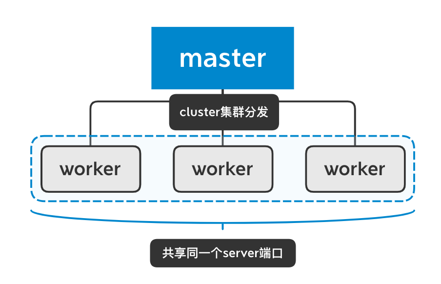
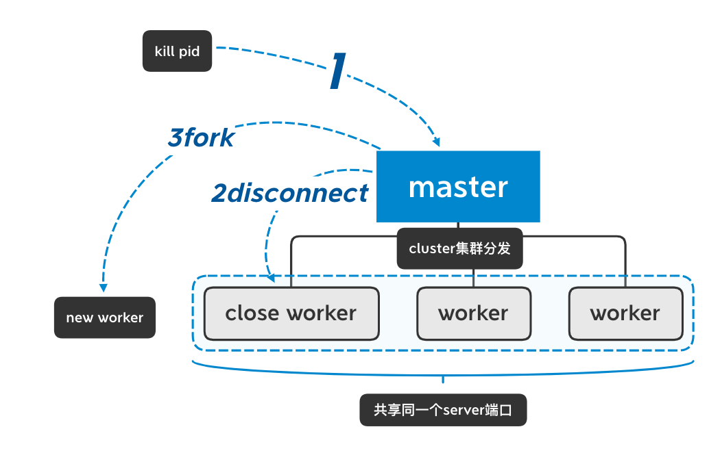

# grace-server
------
通过cluster集群，加强node服务器的稳定性
### 为什么(WHY)
由于node服务器上线有损，所以使用cluster实现无损上线。
### 原理(HOW)


### 使用(HOW TO USE)
- 安装
```bash
npm i -g grace-server
```
- 使用  
1、首先进行配置  
新建`grace-config.js`配置文件，格式如下：
```js
module.exports = {
    entry: './index.js',                // server入口文件
    workerNum: 2,                       // cluster集群worker数量
    graceReloadOnFileChange: true,      // 监听文件修改时，进行平滑重启服务器
    reloadDelay: 1500,                  // worker重启延时,注意，在产品模式下，延时尽量大于1.5s，如果延时过小，会发生worker重启交叉，开发模式可以将性能考虑优先，发生重启交叉的情况不会有很大影响，所以可以设置小于1.5s。
    workerTimeOut: 5000                 // worker强制退出timeOut
};
```
2、server端入口app.js需要将server对象暴露出来
```js
// app.js
var server = http.createServer((req, res) => {
    response.end('hello');
});
server.listen(8080);
// 将server对象导出
module.exports = server;

```
3、当想要上线时：
>将server代码替换  
>使用`kill`进行平滑重启
```bash
kill pid
```
>如果pid不清楚的话  
>可以使用`ps`进行查询
```bash
ps -A | grep grace
```

- 查看版本
```bash
grace -v
```
- 运行
```bash
grace
```
### 版本更新
- v1.1.6  
优化目录结构
完善package.json信息
- v1.1.5  
新增`graceReloadOnFileChange`  
通过监听本地文件，在文件修改时，进行平滑重启
新增`reloadDelay`  
设置worker重启延时
新增`workerTimeOut`
设置worker重启时强制离线timeOut
- v1.1.4  
优化目录结构，将task任务管理进行抽象。
- v1.1.0  
调整文件目录
- v1.0.0  
新增`grace`命令。
```js
grace index.js
```
使用集群方式来启动server服务。